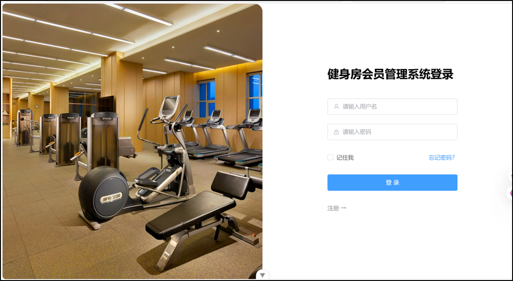
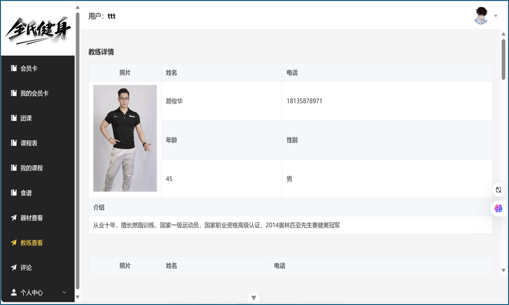
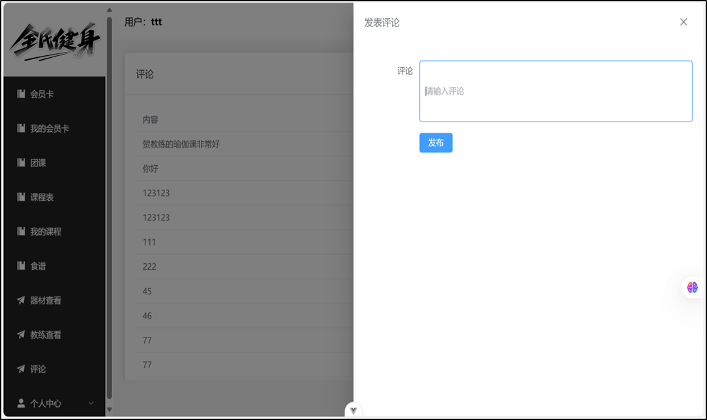

# 健身房管理系统 (JSF_HYGL)

一个功能完善的健身房管理系统，采用前后端分离架构，支持会员管理、教练预约、团课管理、器材管理、评分评论等核心功能。

## 技术栈

### 后端
- **Spring Boot 3.3.5** - 核心框架
- **Java 17** - 编程语言
- **MyBatis Plus 3.5.1** - ORM 框架
- **MySQL** - 数据库
- **JWT** - 用户认证
- **Thymeleaf** - 模板引擎

### 前端
- **Vue 3** - 前端框架
- **Vite** - 构建工具
- **Element Plus** - UI 组件库
- **Pinia** - 状态管理
- **Vue Router** - 路由管理
- **Axios** - HTTP 客户端
- **Sass** - CSS 预处理器

## 功能模块

### 用户模块
- 普通用户注册、登录

  

- 个人信息管理

### 管理员模块
- 用户管理
- 系统数据管理

### 会员卡模块
- 会员卡办理
- 会员卡查询

### 教练管理
- 教练信息展示

  - 

    

- 教练预约

### 团课管理
- 团课列表

- 团课预约

### 器材管理
- 器材信息管理
- 器材状态查看

### 评分与评论
- 服务评分

- 用户评价

  - 
  
    

## 项目结构

```
├── JSF_HYGL idea springboot3/    # 后端项目
│   ├── src/main/java/
│   │   └── com/example/JSF_HYGL/
│   │       ├── Controller/       # 控制器层
│   │       ├── mapper/          # 数据访问层
│   │       ├── pojo/            # 实体类
│   │       ├── service/         # 业务逻辑层
│   │       ├── config/          # 配置类
│   │       ├── interceptors/    # 拦截器
│   │       └── utils/           # 工具类
│   └── src/main/resources/
│       └── application.yml      # 配置文件
│
└── jsf vue3 vscode/             # 前端项目
    └── src/
        ├── api/                 # API 接口
        ├── assets/              # 静态资源
        ├── components/          # 公共组件
        ├── router/              # 路由配置
        ├── stores/              # Pinia 状态管理
        └── views/               # 页面组件
```

## 运行项目

### 后端启动

```bash
cd JSF_HYGL idea springboot3
./mvnw spring-boot:run
```

### 前端启动

```bash
cd jsf vue3 vscode
npm install
npm run dev
```

## 接口文档

启动后端服务后，访问 `http://localhost:端口号/swagger-ui.html` 查看 API 文档。

## License

MIT License